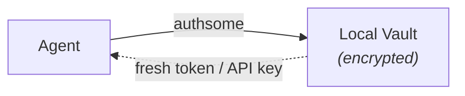

Authsome is a local credential layer for AI agents. You authenticate once with a provider (GitHub, Google, OpenAI, Linear, and more) and authsome keeps the credentials fresh for every agent run that follows.

```bash
pip install authsome
authsome login github
authsome run -- python my_agent.py
```

## Why agents need this

Agents run outside interactive sessions: in CI, over SSH, in cron jobs, in background workers, or in parallel pipelines. They need API access that survives without a human in the loop.

Hardcoded environment tokens leak or go stale. Building auth flow logic, token storage, refresh handling, and per-provider config into every project rebuilds the same plumbing every time.

Authsome is the local credential layer agents call at runtime.

- **No credential sprawl.** One encrypted store — every provider, every agent, one place.
- **No SaaS, no privacy trade-off.** Credentials never leave your machine.
- **No browser required at runtime.** Setup uses browser PKCE, device code, or a browser bridge for secure API key entry. After that, agents run headlessly.

## How it works

The CLI is the agent's interface. Set up once, then inject fresh credentials whenever a tool runs.



Credentials are stored locally in an encrypted SQLite vault, refreshed before expiry, and injected into agents either as environment variables (`authsome export`) or transparently through a local proxy (`authsome run`). No server. No account. No cloud.

## Start here

<Columns cols={2}>
  <Card title="Quickstart" icon="rocket" href="/quickstart">
    Install authsome, log in to your first provider, and run an agent in under 5 minutes.
  </Card>
  <Card title="CLI reference" icon="terminal" href="/reference/cli">
    Every command, every flag, every exit code.
  </Card>
  <Card title="Architecture" icon="layer-group" href="/concepts/architecture">
    The five layers: identity, policy, vault, auth, audit — and the proxy that ties them together.
  </Card>
  <Card title="Custom providers" icon="puzzle-piece" href="/guides/custom-providers">
    Add any OAuth2 or API-key service that authsome doesn't ship out of the box.
  </Card>
</Columns>

## Pick your path

<Columns cols={2}>
  <Card title="Log in with OAuth" icon="github" href="/guides/login-with-oauth">
    Browser-based PKCE flow for services like GitHub, Google, Linear.
  </Card>
  <Card title="Use API keys" icon="key" href="/guides/use-api-keys">
    Secure browser bridge for OpenAI, Anthropic, and similar providers.
  </Card>
  <Card title="Run agents with the proxy" icon="shield-halved" href="/guides/run-agents-with-proxy">
    Inject auth headers without exposing raw secrets to the child process.
  </Card>
  <Card title="Headless setup" icon="server" href="/guides/headless-device-code">
    Authenticate over SSH or in CI with the device code flow.
  </Card>
</Columns>

## Authsome compared

|  | authsome | Hardcoded env tokens | DIY |
|---|:---:|:---:|:---:|
| Automatic token refresh | Yes | No | Build it |
| OAuth2 + API keys | Yes | No | Build it |
| Runtime headless use | Yes | Yes | Varies |
| Local — no SaaS dependency | Yes | Yes | Yes |
| Built-in providers, zero config | Yes | No | No |
| Multi-account per provider | Yes | No | Build it |
